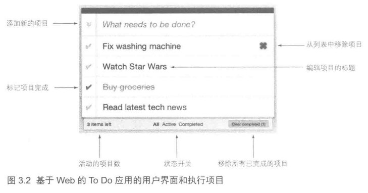

# To-Do 应用程序

## 任务管理用例

每个任务管理系统都是由一个有序的执行项目或者任务列表组成的。

*   每个任务都有一个标题。

*   可以在列表中添加和删除任务，以及将任务标记为活动或者完成状态。

*   可以修改任务标题。

*   当一个任务发生改变时应该自动地持久化到数据库中。

下图显示了用户界面的截图：一个基于 Web 的 To Do 应用的用户界面和执行项目。

## 实现

该版本实现由命令行控制的基本功能。程序将向用户展现一个命令菜单，用户通过菜单输入字符触发一个指定操作来管理 to-do 列表。

为了保证第一轮迭代的解决方案尽可能的简单，我们不会引入数据库来存储数据，而是将它保存在内存里。

该应用所使用的组件如下：

*   `ToDoItem` 代表 to-do 列表中的一个执行项目。

*   `ToDoRepository` 仓库类接口。

*   `InMemoryToDoRepository` 基于内存的仓库实现类，它将所有的 to-do 项目放在 ConcurrentHashMap 实例中。

*   `CommandLineInput` 表示一组操作命令的枚举类。

*   `CommandLineInputHandler` 负责处理用户交互与命令执行。

*   `ToDoApp` 应用程序入口。

下图说明了用户想要列出所有任务所需要执行的操作：

