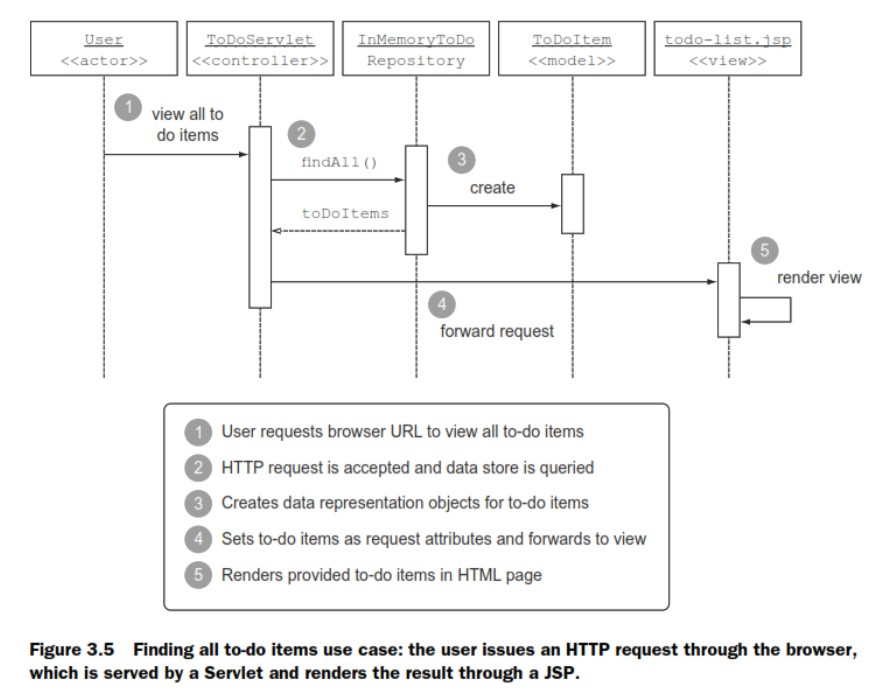

# To-Do 应用程序

## 任务管理用例

每个任务管理系统都是由一个有序的执行项目或者任务列表组成的。

*   每个任务都有一个标题。

*   可以在列表中添加和删除任务，以及将任务标记为活动或者完成状态。

*   可以修改任务标题。

*   当一个任务发生改变时应该自动地持久化到数据库中。

下图显示了用户界面的截图：一个基于 Web 的 To Do 应用的用户界面和执行项目。

## 实现

这里将上一版的应用程序转换为一个 Web 应用。

为了尽可能简单，这里使用了标准的 Java 企业级 Web 组件 Servlet 和 JSP 来构建 Web 应用程序。另外，为了给用户一个流畅和舒适的体验，这里把 to-do 列表做成一个单页面应用。

该应用所使用的组件如下：

*   `ToDoItem` 代表 to-do 列表中的一个执行项目。

*   `ToDoRepository` 仓库类接口。

*   `InMemoryToDoRepository` 基于内存的仓库实现类，它将所有的 to-do 项目放在 ConcurrentHashMap 实例中。

*   `ToDoServlet` 类负责接收 HTTP 请求，执行一个映射到某个 URL 的增删改查操作，并将请求转发到一个 JSP 页面。

*   `todo-list.jsp` 该页面知道该如何动态地渲染 to-do 项目列表，并且提供像按钮一样的 UI 元素和链接启动增删改查操作。

下图显示了在新系统中获取和渲染所有的 to-do 项目的流程。用户通过浏览器发起一个 HTTP 请求，由 Servlet 提供服务，并将结果通过 JSP 渲染出来。

